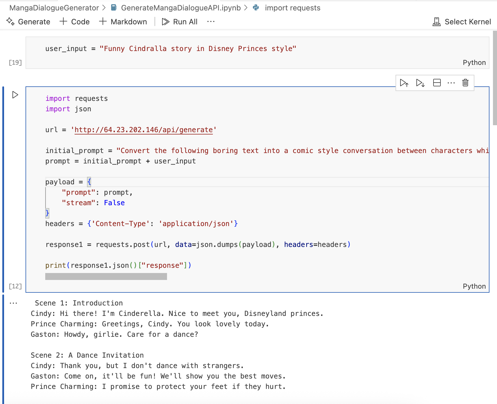
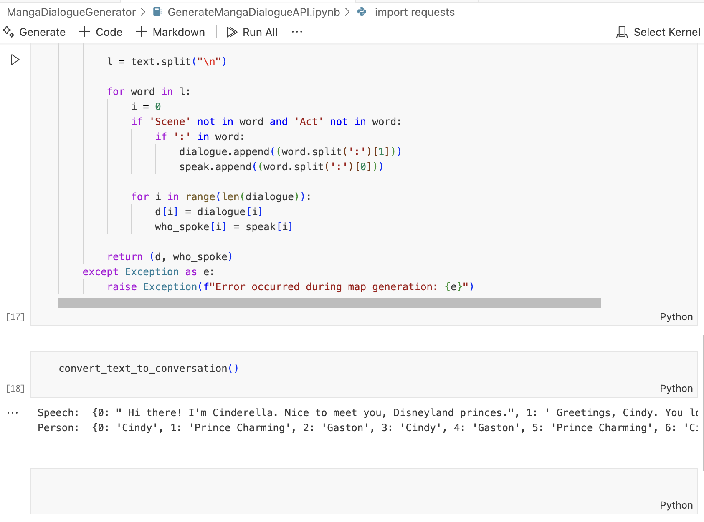
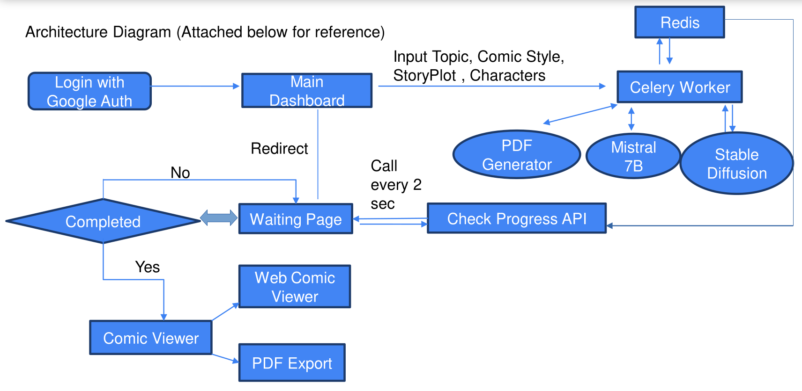

<h1 align="center">MangaAgenticAI</h1>
<p align="center">
    <a href="https://python.org">
    
  </a>
  <a href="https://www.openrouter.ai">
    
  </a>
  <a href="https://flask.palletsprojects.com/">
    
  </a>
  <a href="https://jupyter.org/">
    
  </a>
  <a href="https://github.com/PushpenderIndia/MangaAgenticAI">
    
  </a>
</p>
<p align="center">
  MangaAgenticAI transforms mundane text and challenging topics into engaging, visually stunning Manga and manga through the power of Generative AI.
</p>

# Demonstration of the Project

- https://youtu.be/qYDebYuqkAw

## Problem Statement
- Nowadays students face problem due to `low attention span` which is less than a gold fish.
    - Gold fish attention span: `9 sec`
    - Humans attention span: `8 sec`

- Also, It is `very hard to spread awareness` about topics which are considered
`“taboo”` in our society such as `periods`, `superstations`, `sex education`, etc.

- As per studies conducted in `US by NCBI`, suggested that approx. `65%` of the
population are `visual learners`, So learning from textual content leads to
    - Difficulty in Conceptualization
    - Reduced Retention
    - Limited Engagement
    - Difficulty in Problem-Solving
    - Limited Creativity and Expression
    - Increased Cognitive Load

## Our Solution
- Our idea is to build Gen AI powered platform, which will `convert boring textual content or taboo topics` to visually appealing `Manga/manga`.

- User can `specify plot` & `characters` of the storyline `or just enter a topic` and it will generate a Manga book as per their `Manga style` i.e. `Marvel`, `DC`, `Disney Princess`, `Anime` etc.

- Our platform will utilize `text-to-image transformations` using `Stable
Diffusion`.

- We will optimize the pipeline to `generate a Manga under 30-50 secs` using `Multithreading` & `Caching database (Redis)`.

## Features Offered
- [X] Generate in your favourite Manga style i.e. Marvel, DC, etc
- [X] Ability to set custom characters and story plot
- [X] Generate Shareable Manga link or share Manga pdf
- [X] Enhances user experience with realistic animations simulating page turning
and book opening/closing, creating an immersive digital reading
environment.
- [X] Ability to create vernacular(Hindi/English/Tamil/etc) Manga

## Sample Manga Generated By Our Platform
1. [Dragon Tale](/static/pdfs/dragon_tale.pdf)
2. [Vampire Story](/static/pdfs/vampire_story.pdf)
3. [Naturo preparing for exam](/static/pdfs/naruto_preparing_for_exams_.pdf)

# Comify : Two Models

 1. [Manga-Dialogue-Generator 📝](#Manga-Dialogue-Generator)
 5. [Manga-Scenes-Generator 💬🤖](#Manga-Scenes-Generator)

<a name="Manga-Dialogue-Generator"></a>
## Manga-Dialogue-Generator 📝

- This code snippet demonstrates the utilization of Text Generation model, leveraging a model from Openrouter.ai. 
- Facilitating the generation of Manga dialogues based on textual prompts. 
- For Creating High quality Manga scene images, we are Generating dynamic image prompts for specifying minute details about the Manga scenes, these dynamic image prompts are created using neuralchat by supplying Manga scene dialogue.
- By loading the model onto the available device along with our custom post processing code, the script efficiently processes the input prompt and produces Manga dialogues in a Json format. 
- We have used OpenRouter.ai (service which have all the LLMs deployed on there platform) for its blazing fast and hustle free LLM api integration

>Prompt : Funny Cindralla story in Disney Princes style




**Notebook Link** : [Click Here](https://github.com/PushpenderIndia/MangaAgenticAI/blob/main/MangaDialogueGenerator/GenerateMangaDialogueAPI.ipynb)

<a name="Manga-Scenes-Generator"></a>
## Manga-Scenes-Generator 👤🚀

- This code implements an image generation model using Stable Diffusion running on stability.ai
- The model is designed to generate visually appealing Manga scenes. 

# Flow Diagram 🔄📊

1. User will login with **google auth** & will get redirected to main dashboard.
2. User will enter **Topic**(required), **Manga style**(optional), **Story plot**(optional) & **Characters** (optional).
3. After hitting enter, web application will run a **celery worker for generating a Manga**
4. User will be **redirected to waiting page** where he will **get info** about the **progress**.
5. Once Manga is generated, user will be **redirected to Manga viewer**
6. Manga viewer will have **options** to **download** the **Manga** in **pdf format** or **share** the **web Manga viewer link**.

## Architecture Diagram



# Technologies Used 🛠️    
1.  **Backend - Flask:** Our application's backend was constructed using Flask, a versatile Python web framework. Flask facilitated the development of RESTful APIs, user authentication, data processing, and integration with machine learning models efficiently and swiftly. 🐍🚀

3.  **Large Language Models:** Our app utilizes advanced LLM models for manga dialoge generation and Image Generation models for manga scenes
    
4.  **Other Technologies:** In addition to React, Flask, and machine learning models, our application utilizes a range of other technologies to enhance performance, security, and user experience. These include:

    -   **Celery:** Manga Generation usually takes more than 30 secs, which can leads to 502 Gateway error, so we've implemented Celery Worker by which the Manga generation pipeline will be executed on server.
    -   **Redis** It is used as Broker & Caching Database to boost the performance & also used in developing flask api for showing Manga progress on fronted (Loading Page)

# How We Built It 🛠️👷‍♂️

 - User inputs a topic with story plot
 - The `Input Text` is then given to `Openrouter.ai's deployed LLM`
 - `Raw Manga Dialogues Text` is then parsed using `Post Processing functions` which `returns` the `result` in `JSON Format`
 - `For Generating Manga Poster`, a Dynamic Image Generation prompt is generated by supplying Manga topic.
 - `Dynamic Image prompt` is then `given to Image Generation Model` (Stable Diffusion)
 - Similarly for generating Manga scenes, a dynamic image prompt is generated using neuralchat by supplying Manga Scene Dialogue
 - Then that dynamically generated prompt is used to generate Manga scenes using Stable Diffusion
 - `Multithreading` is used for `parallel image & text generation`
 - Once Manga Images are generated, we `write` the `text on top of image` using `OpenCV` in `Manga font`
 - Then Finally we merge the images using custom `Image List to PDF generator` code
 - `Celery worker` runs the above task & updates the `Redis db` for `saving` the `progress`
 - We have created a `Flask-Restful api` which is connected to redis for `fetching the progress`
 - `Loading page` calls this api `every 2 seconds` and shows the `progress` on the page
 - Onces the `api status is completed`, the page automatically `loads` the `Manga viewer`
 - `Manga viewer` has the functionality to either `read the Manga on website itself` using `realistic page turn animation` & providing immersive Manga reading experience
 - Also at the end of Manga page, there is a option to `download` the `Manga in PDF format`

## Installation
```
# Install Redis
sudo apt install redis-server nginx python3-pip -y
sudo systemctl start redis-server
sudo systemctl enable redis-server
sudo service redis-server status 

# Install VirtualEnv
pip3 install virtualenv

# Clone Project
git clone https://github.com/PushpenderIndia/MangaAgenticAI

# Navigate to folder
cd Comify

# Create Virtual Environment
virtualenv venv

# Activate Virtual Env.
source venv/bin/activate

# Install Requirements
pip install -r requirements.txt
```

## Run in Terminal - 1
```
python app.py
```

## Run in Terminal - 2
```
celery -A app.celery worker --loglevel=info
```

## TeamMate 

<table>
<tr>

<td align="center">
    <a href="https://github.com/PushpenderIndia">
        <kbd></kbd><br />
        <sub><b>Pushpender Singh</b></sub>
    </a><br />
    <a href="https://github.com/PushpenderIndia" title="Code"> :computer: </a> 
</td>

<td align="center">
    <a href="https://github.com/khusburai28">
        <kbd></kbd><br />
        <sub><b>Khusbu Rai</b></sub>
    </a><br />
    <a href="https://github.com/khusburai28" title="Code"> :computer: </a> 
</td>

</tr>
</tr>
</table>